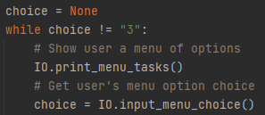

# Products List – Class Objects

## Introduction
This week we learned to how to create a class object to store and process data.  We learned how we can use this “blueprint” method to create multiple objects of the same class and give them attributes as they are created.  This assignment covers the details within these classes, including constructors, properties, methods, and attributes.

## The Class Object
After declaring the variables for my list and file that will be used in the program, I created my first object. This is done the same way as creating any class. I’ve included “object” in defining my class, but this is technically not required (Figure 1), as it would be automatically inherited without it.

*Figure 1: Creating my Product Class*

### The Constructor
The first thing I do after creating my product class is to create my class constructor (Figure 2). The constructor will initialize every time that a new object is created from this class. Setting it up this way allows me to give the product attributes right off the bat. The constructor will allow the program to provide the product name and product price when the object is created. I can also set them to string and float, respectively. Both of these attributes have been set to private, using double underscores, to prevent direct access from outside the class. Self just means that it will relate only to the object that is currently created.

*Figure 2: Creating my Product Class*

### Properties
In order to allow access to these private attributes, I also created properties. There is one for each attribute (Figure 2). These act as “accessors” of the attributes.

*Figure 3: Creating the attribute properties*

Following this, I created the name setters for these two attributes. This allows the program to properly set the name and price attributes (Figure 4).

*Figure 4: The name setters for the properties*

### Methods
I also decided to create an additional method (functions that are within a class) in my product class. This method allows the program to add a newly inputted product info in the list by directly calling on the class itself (Figure 5). You’ll see how this works in the main program.

*Figure 5: The add_to_list method within the Product class*

## The File Processing Class
The second class created is pretty self-explanatory (Figure 6). It processes files. It has two methods within it, one that reads from a file and one that writes to a file (Figure 7).

*Figure 6: Creating the FileProcessor class*

*Figure 7: The read and save file processing methods*

## The IO Class
The IO class performs a number of input/output tasks (Figure 8).

*Figure 8: Creating the IO class*

The first two methods in this class print the menu of choices to the user and accept input back from the user with their choice (Figure 9).

*Figure 9: The choice menu and choice input methods*

The other two methods in the IO class print the current product list to the user and accept input for a new product from the user (Figure 10). I’ve added some code in the print function that displays the price in a dollar format.

*Figure 10: Print list and new product input methods*

## The Main Program
Now that I have all of my classes created, I can use them in my main program. I’ve chosen to group all of this code into its own function (Figure 11). Doing this just allows for cleaner code, where I can run the program at the very end.

*Figure 11: Defining my main program function*

The first step is to call on the file processing function that reads data from the file and puts it into the list (Figure 12). Because the possibility exists that the file may not exist yet, I added some error handling to account for that. This will allow the program to continue running and give the user the chance to enter data.

*Figure 12: Reading the file with error handling*

Next, I created a while loop that will check to see if the user had chosen “3”, which would end the program. To do this I started by first creating an empty string variable. If they have not chosen “3”, then the program will call on the print menu and input functions (Figure 13).  The users choice is taken from the input return and stored in the “choice” variable.

*Figure 13: The beginning of the while loop*

### Option 1
If the user enters “1” for their choice, then the current data in the list will be presented to them. Similar to the error handling described earlier, if there is no list data (due to the file not being available), then the program accounts for that (Figure 14).

*Figure 14: Choice “1” from the user*

### Option 2
Should the user choose option “2”, then they can input new product data (Figure 15). This is done by calling on the IO class method for inputting a new product. The process is stored within a try block so that I can account for a value error that would occur if the user were to put a string value in for the price.  The new name and price are stored in variables. 
Though not a true “error”, I wanted to prevent the user from putting the price within the product name, so I created an if statement to check for that. This prints a message to the user and then uses the continue statement to return to the top of the loop.
If the if statement passes, then the program will check for any value error on the price input. Assuming that is ok, the program will create a new object using the Product class and use the variables to assign name and price. I then call on the object’s class method to add the data to the list, catching its status message in the process.

*Figure 15: Choice “2” from the user*

### Option 3 and No Option
Finally, choice “3” will allow the user to save and exit the program (Figure 16). This is done by calling on the save method in the file processing class. Since the while loop is dependent on choice not being “3”, the program will exit the loop after this runs. 
I’ve also created an else statement to account for a user not entering a valid choice.

*Figure 16: Choice “3” and invalid choice*

## Running the Main Program
Having put the main program within a function, calling on it is easy (Figure 17). The program will run here and print an input message when it is finished.

*Figure 17: Running the program*

## Summary
This week was all about classes, methods and error handling. The code for this assignment displayed how you can use all of these to organize your code, create blueprints using an object class, and prevent errors from breaking your program.
